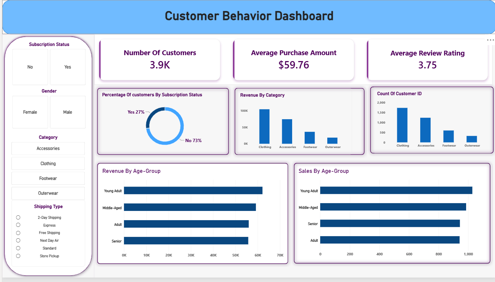

# 📊 Customer Behavior Analysis

## 📌 Overview

This project is an end-to-end **Customer Behavior Analysis** project that explores customer shopping patterns and generates business insights from customer transaction data.

The project follows a complete data analytics workflow, starting with raw data and ending with an interactive Power BI dashboard, detailed report, and business presentation.

### 🔄 Project Workflow

**Dataset → Python → EDA → Data Cleaning → MySQL → SQL Analysis → Power BI Dashboard → Report → Presentation**

The main objective of this project is to understand customer purchasing behavior, identify trends and patterns, and present the findings in a clear and business-friendly way.

---

## 📂 Dataset

The project uses a customer shopping behavior dataset:

**File:** `customer_shopping_behavior.csv`

The dataset contains information related to customer purchases and shopping behavior.

The data was first loaded into Python and analyzed to understand its structure, quality, and important variables before performing further analysis.

### Dataset Analysis Included

- Dataset structure and dimensions
- Column and data type analysis
- Missing value checks
- Duplicate record checks
- Numerical analysis
- Categorical analysis
- Customer behavior analysis
- Purchasing pattern analysis

---

## 🛠️ Tools & Technologies

| Tool / Technology | Purpose |
|---|---|
| **Python** | Data analysis and preprocessing |
| **Pandas** | Data manipulation and cleaning |
| **Jupyter Notebook** | EDA and data preparation |
| **MySQL** | SQL-based data analysis |
| **Power BI** | Dashboard and visualization |
| **Gamma** | Business presentation |
| **GitHub** | Project hosting and documentation |

---

# 🔎 Project Process

## 1. 📥 Data Loading

The customer shopping behavior dataset was loaded into Python using Pandas.

Initial inspection was performed to understand:

- Number of records
- Number of columns
- Column names
- Data types
- Missing values
- Duplicate records
- Basic statistics

The complete Python workflow is available in:

`customer_shopping_behavior.ipynb`

---

## 2. 📊 Exploratory Data Analysis

Exploratory Data Analysis (EDA) was performed to understand the characteristics and patterns within the dataset.

The analysis included:

- Descriptive statistics
- Distribution analysis
- Categorical variable analysis
- Numerical variable analysis
- Missing value analysis
- Duplicate value analysis
- Customer behavior analysis
- Purchasing pattern analysis
- Data visualization

EDA helped identify important patterns and potential data-quality issues before moving to further analysis.

---

## 3. 🧹 Data Cleaning

The dataset was cleaned and prepared for SQL analysis and visualization.

The cleaning process included:

- Checking for missing values
- Checking for duplicate records
- Correcting data types
- Handling inconsistent values
- Standardizing data
- Removing unnecessary data where required
- Preparing the cleaned dataset for analysis

The data cleaning process was performed using Python and Pandas.

---

## 4. 🗄️ MySQL & SQL Analysis

After preparing the data, it was imported into **MySQL** for structured analysis.

SQL queries were used to extract meaningful information from the dataset and answer business-related questions.

The analysis included:

- Filtering records
- Aggregating data
- Grouping data
- Sorting results
- Customer analysis
- Product/category analysis
- Purchase behavior analysis
- Identifying trends and patterns

The SQL queries used in the project are available in:

`customer_shopping_behavior.sql`

---

# 📈 Power BI Dashboard

The analyzed data was used to create an interactive **Power BI dashboard**.

The dashboard provides a visual overview of customer shopping behavior and allows users to explore the data through different charts and filters.

### Dashboard Includes

- Key performance indicators
- Customer analysis
- Purchase analysis
- Product/category analysis
- Trend analysis
- Interactive visualizations
- Filters and slicers

### Dashboard Preview



### Power BI File

The complete Power BI dashboard is available here:

**`Customer_Behavior_Dashboard.pbix`**

---

# 📌 Results & Insights

The project provides a structured view of customer shopping behavior and helps identify meaningful patterns in the dataset.

The analysis focuses on:

- Customer purchasing patterns
- Customer segments
- Product/category performance
- Spending behavior
- Purchasing trends
- Differences between customer groups
- Business-related patterns in customer transactions

The detailed analysis and findings are documented in the project report and presentation.

---

# 📄 Project Report

A detailed report was created to document the complete project.

The report covers:

- Project objective
- Dataset overview
- Data preparation
- Exploratory Data Analysis
- Data cleaning
- SQL analysis
- Power BI dashboard
- Key findings
- Business insights
- Conclusion

### 📑 Report

**[View Project Report](Customer%20Shopping%20Behavior%20Analysis.pdf)**

---

# 🎯 Presentation

A business presentation was created using **Gamma** to communicate the project findings in a concise and visual format.

The presentation summarizes:

- Project objective
- Dataset
- Analysis process
- Key findings
- Dashboard
- Business insights
- Conclusion

### 📊 Gamma Presentation

**[View Project Presentation](Customer-Shopping_Behavior_presentation.pdf)**

---

# 📁 Project Structure

```text
Customer_Behavior_Analysis/
│
├── customer_shopping_behavior.csv
│
├── customer_shopping_behavior.ipynb
│
├── customer_shopping_behavior.sql
│
├── Customer_Behavior_Dashboard.pbix
│
├── customer_dashboard.png
│
├── Customer Shopping Behavior Analysis.pdf
│
├── Customer-Shopping_Behavior_presentation.pdf
│
├── README.md
│
└── LICENSE
